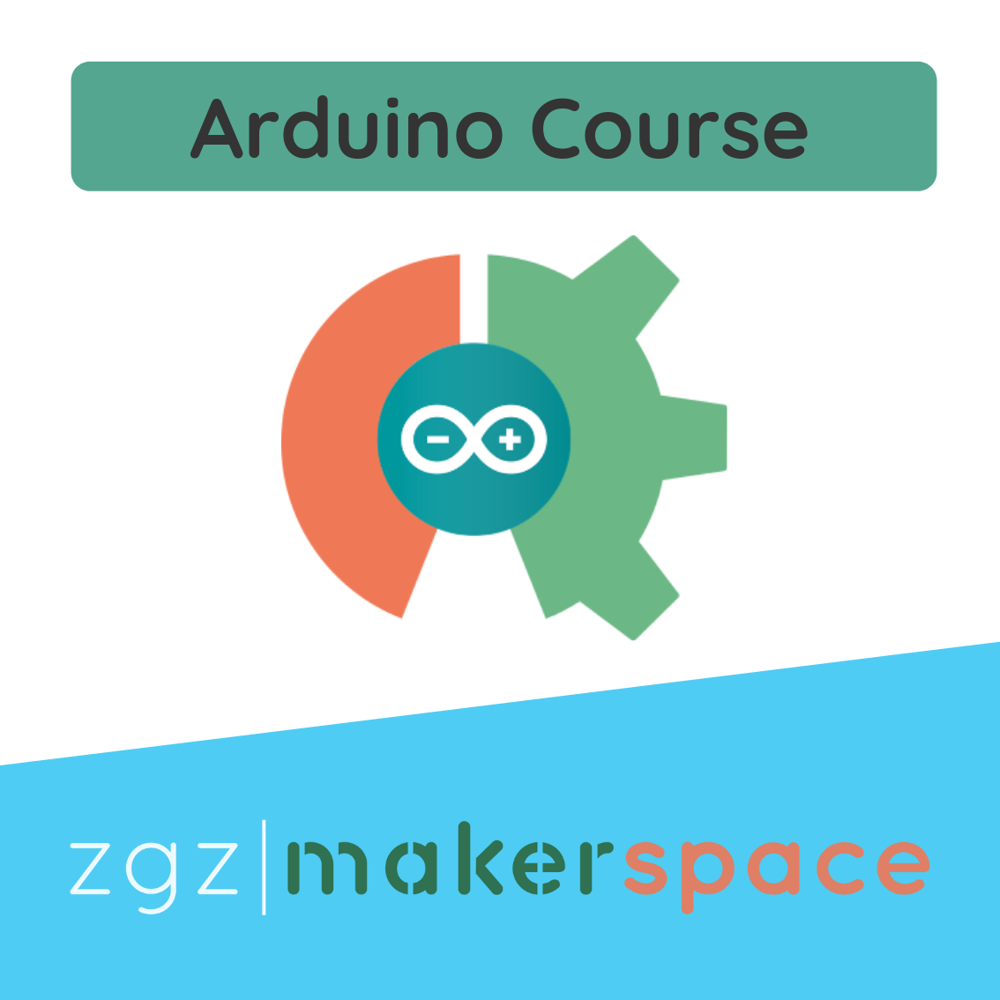
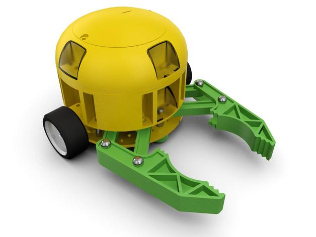
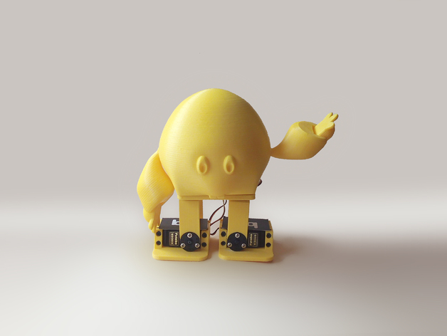

# ArduinoCourse
<h2>Curso Arduino orientado a desarrollo de proyectos</h2>

  
  

Durante este curso daremos los pasos necesarios para empezar a desarrollar programas con nuestra placa y enfocar el desarrollo con un objetivo definido.

Elaborar algunos programas para aprender a programar y desarrollar nuestros primeros proyectos con Arduino.

 
<h3><a href="https://zaragozamakerspace.com/index.php/courses/curso-basico-arduino/">Documentación Online</a></h3>

<h3>Programación y guión del curso.</h3>
<ol>
	<li><a href="https://zaragozamakerspace.com/index.php/lessons/curso-arduino-y-robotica-instalacion-ide-de-arduino/">Instalación del IDE de  Arduino</a>
		<ul>
			<li><a href="https://zaragozamakerspace.com/index.php/arduino-online-como-usar-ardublockly/">Familiarización con el entorno Ardublockly</a></li>
			<li><a href="https://zaragozamakerspace.com/index.php/lessons/curso-arduino-y-robotica-serial-monitor/">Comunicación Serie - Debug y visualización gráfica de variables con <strong>Serial Plotter</strong></a></li>
			<li><a href="https://zaragozamakerspace.com/index.php/lessons/curso-arduino-robotica-entradas-y-salidas/">Entradas y Salidas digitales/analógicas">Entradas y Salidas digitales/analógicas</a></li>
			<li><a href="https://zaragozamakerspace.com/index.php/lessons/control-umbral/" target="_blank" rel="noopener">Arduino Threshold - Control umbral</a></li>
		</ul>
	</li>
	<li><a href="https://zaragozamakerspace.com/index.php/lessons/curso-arduino-y-robotica-estrategias-antibloqueo-en-bucle/">Funcionamiento de Arduino en bucle aplicado a robótica - Estrategias antibloqueo</a>
		<ul>
			<li><a href="https://zaragozamakerspace.com/index.php/lessons/curso-arduino-y-robotica-eventos-discretos-y-maquinas-de-estados/">Basado en evento discretos - Máquinas de estados</a></li>
			<li><a href="https://zaragozamakerspace.com/index.php/lessons/curso-arduino-y-robotica-eventos-temporales/">Basado en eventos de tiempo</a></li>
			<li><a href="https://zaragozamakerspace.com/index.php/lessons/curso-arduino-y-robotica-interrupciones/">Interrupciones</a></li>
		</ul>
	</li>
	<li>Servomotores
		<ul>
			<li> <a href="https://zaragozamakerspace.com/index.php/lessons/curso-arduino-y-robotica-servomotores/">Control en Bucle </a></li>
			<li> <a href="https://zaragozamakerspace.com/index.php/lessons/curso-arduino-y-robotica-servomotores-casos-de-calibracion/">Casos de Calibración</a></li>
			<li> <a href="https://zaragozamakerspace.com/index.php/lessons/curso-arduino-y-robotica-servomotores-movimiento-senoidal/"> Movimiento Senoidal </a></li>
		</ul>
	</li>
	<li>Librerías
		<ul>
			<li><a href="https://zaragozamakerspace.com/index.php/lessons/curso-de-arduino-y-robotica-instalacion-de-librerias-no-oficiales-filosofia-open-software/">Filosofía open software - Instalación de librerías no oficiales</a></li>
			<li><a href="https://zaragozamakerspace.com/index.php/lessons/curso-de-arduino-y-robotica-comunicacion-bluetooth/">Librería SoftwareSerial - Comunicación Bluetooth</a></li>
		</ul>
	</li>
	<li><a href="https://zaragozamakerspace.com/index.php/lessons/curso-arduino-y-robotica-motores-dc/">Motor DC</a>
		<ul>
			<li><a href="https://zaragozamakerspace.com/index.php/lessons/curso-de-arduino-y-robotica-driver-l298n-etapa-de-potencia/">Driver o alimentación  - Etapa de potencia</a></li>
			<li><a href="https://zaragozamakerspace.com/index.php/lessons/curso-arduino-y-robotica-sensor-optico-encoder-wheel/">Sensor óptico + Encoder Wheel</a></li>
		</ul>
	</li>
	<li> Vectores
		<ul>
			<li><a href="https://zaragozamakerspace.com/index.php/lessons/curso-de-arduino-y-robotica-arrays-o-vectores/">Arrays o vectores - Uso de bucles</a></li>
			<li><a href="https://zaragozamakerspace.com/index.php/courses/curso-basico-arduino/">Estrategias de diseño aplicados a la programación</a></li>
		</ul>
	</li>
	<li><a href="https://zaragozamakerspace.com/index.php/lessons/curso-arduino-y-robotica-motores-paso-a-paso/">Motores paso a paso</a>
		<ul>
			<li><a href="https://zaragozamakerspace.com/index.php/lessons/curso-arduino-y-robotica-motores-paso-a-paso/">Conexión e instalación</a></li>
			<li><a href="https://zaragozamakerspace.com/index.php/lessons/curso-de-arduino-y-robotica-libreria-accelstepper/">Control por driver, instalación de librería AccelStepper</a></li>
		</ul>
	</li>
	<li><a href="https://zaragozamakerspace.com/index.php/lessons/curso-de-arduino-y-robotica-i2c/">I2C</a>
		<ul>
			<li><a href="https://zaragozamakerspace.com/index.php/lessons/curso-de-arduino-y-robotica-i2c/">¿Qué es el protocolo I2C?</a></li>
			<li><a href="https://zaragozamakerspace.com/index.php/taller-2-i2c-maker-show/">Sensores I2C más útilizados</a></li>
		</ul>
	</li>
	<li> ICSP
		<ul>
			<li><a href="https://zaragozamakerspace.com/index.php/lessons/curso-de-arduino-y-robotica-icsp/">Qué es ICSP?</a></li>
			<li><a href="https://zaragozamakerspace.com/index.php/lessons/curso-de-arduino-y-robotica-programar-arduino-por-icsp/">Como programar un Arduino por ICSP</a></li>
		</ul>
	</li>
</ol>

<h1 style="text-align: center;">Proyectos Disponibles a desarrollar</h1>
Es el momento de elegir cuál es tu nivel y cuál es el robot que mejor se ajusta a tus habilidades. Disponemos de tres niveles de dificultad.
<ul>
 	<li>Nivel básico - Robot controlado remotamente con aplicación Bluetooth</li>
 	<li>Nivel avanzado - Robot Siguelineas de alta velocidad</li>
 	<li>Nivel Extremo - Robot articulado con diferentes grados de libertad</li>
</ul>

  
  
  
  

